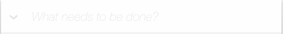

# 🚀 Welcome to VUE-Todos project!

本项目使用[TodoMVC](http://todomvc.com/)的模板，采用VUE框架完成了Todo List的功能。

运行项目前，请使用以下命令安装需求包：

```
npm install
```

使用以下命令运行项目：

```
cd 08_vue_todos/

npm run start
```
---

###项目功能说明

1. 添加todo

    + 在输入框输入要添加的事务后，按下enter即可。 

    

2. 删除todo

    1. 点击要删除的事务尾部的即可。
    2. 点击`clear completed`可删除已完成的事务

3. 选中事务（标记为完成）

    + 点击要选中的事务前的, 图标为时为选中状态。

4. 编辑事务

    + 仅当任务未完成时可以被修改，双击要修改的目标，编辑完成后按下`ESC`取消本次编辑内容，按下`enter`或`点击其他任意地方`后保存本次编辑。

5. 查看事务状态切换

    + 可在`all`、`active`和`completed`状态中切换查看事务列表, 在任意查看状态下均可进行添加、删除、编辑、标记等操作。

###其他说明

    本项目为VUE练习项目，仅实现了Todo List的基本功能，业务逻辑仍有不足的地方还请提出修改意见，谢谢。