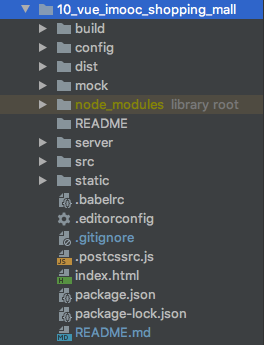

# 10_vue_imooc_shopping_mall

> 该项目是商城练习内容，主要练习前后端的业务逻辑。

## 主要技术栈

-   前端：Vue2 Vuex Vue-Router
-   后端：Express Mongoose
-   数据库：MongoDB

## 项目文件结构

> server: 后端express代码   
> README: readme文件静态资源

## 项目基本功能

一. 用户管理
   1. 注册
   2. 登录
   
二. 商品管理
   1. 首页商品展示：依据价格排序、依据价格筛选、图片懒加载

三. 购物车管理
   1. 商品加入购物车
   2. 购物车商品选中、删除、全选
   3. 购物车选中商品数量展示
   
四. 收获地址管理
   1. 设置默认收获地址
   2. 删除、添加收获地址
   
五. 订单管理
   1. 生成订单
   2. 完成订单
   
## 待完成

-   前端验证用户输入信息（用户名、密码、地址信息）
-   后台管理页面（商品添加、修改、删除）
-   用户交互提示（用户登录成功、添加成功信息）

