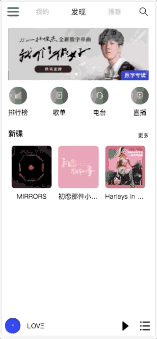
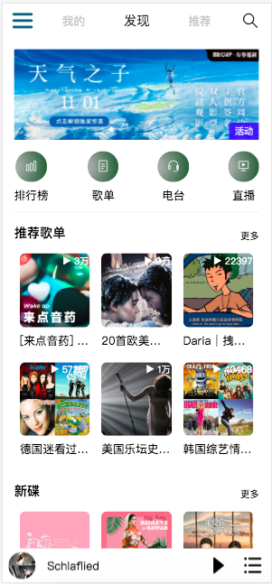
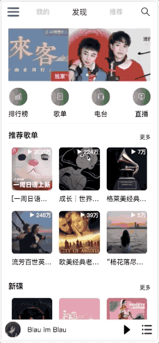
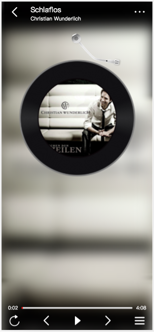
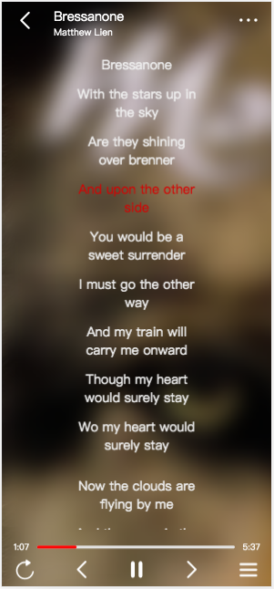
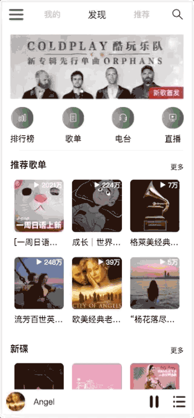
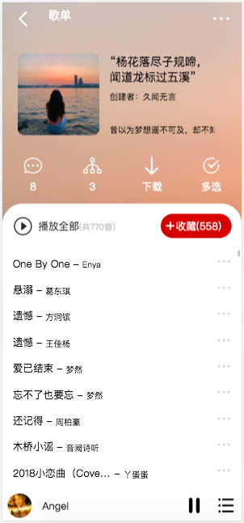
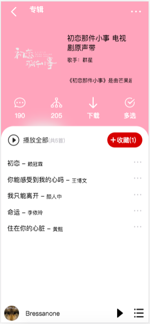
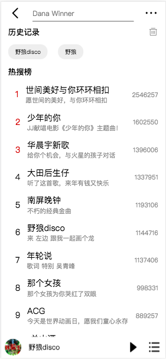

# 移动端云音乐

## 项目目的
模仿网易云音乐客户端对移动端布局、音乐播放网站前端业务逻辑进行练习。

## 技术清单
- 前端：Vue、Vuex、Vue-router、Vant、less
- 后端API：[NeteaseCloudMusicApi](https://github.com/Binaryify/NeteaseCloudMusicApi)

## 项目安装
```
npm install
```

### 生产环境编译
```
npm run serve
```

### 发布环境编译
```
npm run build
```

## 项目运行页面

> 使用Chrome iPhoneX 预览效果

- 首页&登录展示
  <div>
    
    
  </div>

- 播放器页面展示
  <div>
    
    
    
  </div>

- 歌单&专辑页面展示
  <div>
    
    
    
  </div>

- 搜索页面展示
  <div>
    
    
    
  </div>

## 功能说明
1. 用户登录：</br>
由于部分API需登录后使用，目前仅使用手机登录方式并且使用get方式提交数据，为防止个人信息泄露使用时请申请测试号码。

2. 首页：</br>
展示轮播图、推荐歌单（需登录）、最新专辑

3. 播放器：</br>
- 页面初始化时添加推荐歌曲
- 播放，暂停
- 播放列表前/后首歌曲切换
- 播放模式顺序/随机/单曲切换
- 点击进度条跳转功能

4. 当前歌曲：</br>
- 唱片机动画效果
- 歌词展示
- 当前歌词高亮展示
- 歌曲当前时长/总时长

5. 歌单页：</br>
- 歌单详情展示
- 歌单列表加入当前播放列表

6. 专辑页：</br>
- 专辑详情展示
- 专辑列表加入当前播放列表

7. 搜索页：</br>
- 默认搜索内容
- 展示搜索历史记录、热门搜索
- 删除历史记录

8. 搜索结果页：</br>
- 默认显示30条搜索结果
- 上拉加载更多搜索结果
  
## Bug记录

描述：图片运动时,如轮播图播放，唱片机效果播放时，页面产生轻微闪烁现象
- 状态：已解决
- 方案：对闪烁元素或图片元素添加样式translateZ(0)

描述：播放中刷新页面，播放状态保持为播放，但歌曲未播放
- 状态：待处理
- 方案：在player mounted钩子函数中控制播放状态，刷新时设置为false

描述：暂停时记录唱片机转动当前位置
- 状态：待处理
- 方案：

## 待完善功能

- “我的”、“推荐”页面功能
- 优化ICON图标